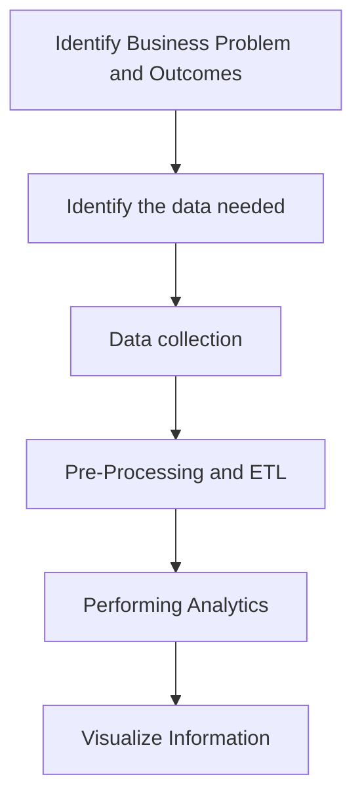

# Big Data Lecture 3

> __Hadoop + Spark__ practice the most practical machine learning algorithms, 
> __Algorithms + Software__ to create the core characteristics of competitiveness.

## Overview of Big Data

__Data__: A general term for all symbols that can be entered into a computer and processed by a computer program.

__Data Types__:

- Structured Data: salary sheet, etc
- Semi-Structured Data: XML, JSON files
- Unstructured Data: TXT

__The Dawn of the Big Data Era__:

- __Total Global Data: growing__
- __Large amount of data per day: Mass amount of data__
- 90% of digital content will be unstructured

__NoSQL DBMS__: Mongo DB, HBase, Neo4j

__Big Data__ refers to datasets that grow so large that it is difficult to capture, store, manage, share, analyze and visualize with those traditional(database) software tools.

__The 4V Characteristics of Big data__: Volume, Velocity, Variety, Value

__3 Phrase of Big Data__:

1. Structured content
2. Unstructured content
3. Sensor Based content

__General Process of Data Processing__:

- Data Acquisition
- Data Management
- Data Analysis
- Data Visualization and Interaction

__Different technologies of Big Data and their functions__:

| Technical Level | Functions |
| ------ | --------- |
| Data acquisition and preprocessing | ... |
| Data storage and management | ... |
| Data processing and analysis | ... |
| Data Privacy and Security | ... |

Relationship with cloud computing and Artificial Intelligence:

- Cloud computing is the computing infrastructure for big data aggregation and analysis
- Big data analytics objectively supports the development of a range of artificial intelligent tasks

The core of machine generated intelligence: data + computation + association

## The meaning of Big Data Analytics

- Big Data Analytics is the process of analyzing Big Data
- provide past, current, and future statistics and useful insights that can be used to make better business decisions
- Big Data analytics is broadly classified into two major categories, data analytics and data science, which are interconnected disciplines
- __Data analytics__ focuses on the collection and interpretation of data, typically with a focus on past and present statistics.
- __Data science__, on the other hand, focuses on the future by performing explorative analytics to provide recommendations based on models identified by past and present data.

### Two main types of Big Data Analytics

__Data Analysis__: Descriptive Analytics (What Happened?), Diagnostic (Why it happens?)
__Data Science__: Predictive Analytics (What will happen next?), Prescriptive (What should be done to prevent?)

### Difference between data analytics and data science

| | Data analytics | Data Science |
| --- | --- | --- |
| __Perspective__ | Looking backward | Looking forward |
| __Nature of work__ | Report and optimize | Explore, discover, investigate and visualize |
| __Output__ | Reports and dashboards | Data product |
| __Typical tools used__ | Hive, Impala, Spark SQL, and HBase | MLlib and Mahout |
| __Typical techniques used__ | ETL and exploratory analytics | Predictive analytics and sentiment analytics |
| __Typical skill set necessary__ | Data engineering, SQL, and programming | Statistics, machine learning, and programming |

## Big Data Analytics & Hadoop and Spark

- Traditional relational database RDBMS uses a Schema on-Write.
- Data is transformed and loaded in an easily accessible (consumable) format, requiring a predefined format/pattern for the data.
- Used to extract, transform and load data, data analysts can only operate within predefined limits.
- Transforming data into a consumable format generally results in losing raw/atomic data
- Traditional relational databases are also more difficult to handle unstructured data.

### SOR Database

Schema-on-Read database:  

- storing the data in a raw, unmodified format
- Apply/refer to a pattern only when reading data

### Life cycle of Big Data analytics

1. Identifying the problem and outcomes
    - Identify the business problem and desired outcome of the project clearly
2. Identifying the necessary data
    - Identify the quality, quantity, format, and sources of data
3. Data collection
