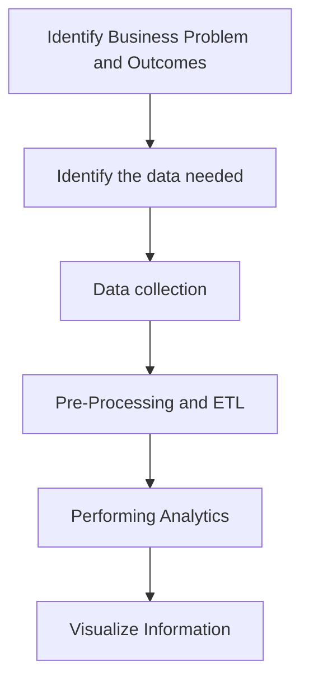
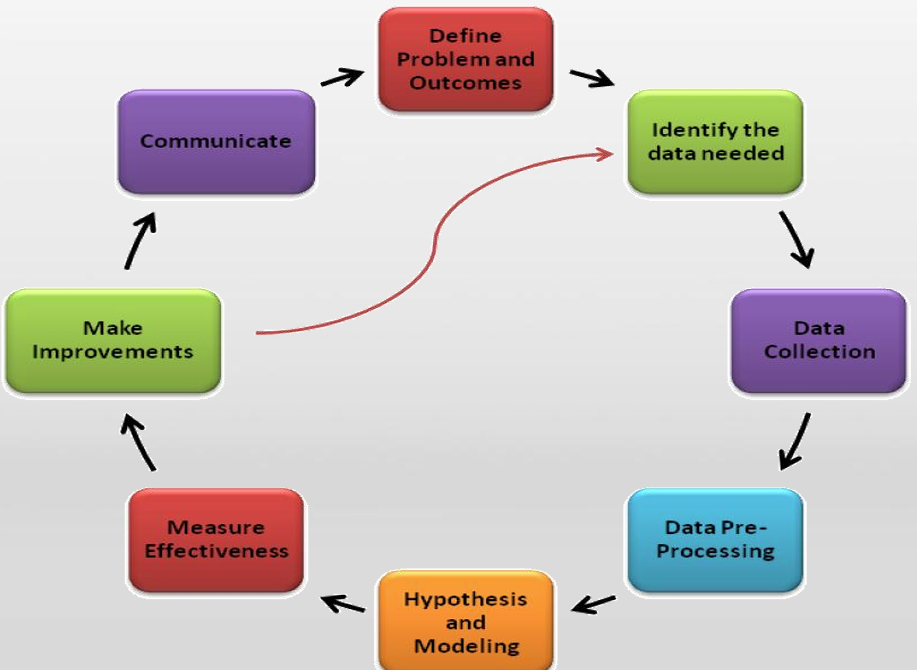

# Big Data Lecture 3

> __Hadoop + Spark__ practice the most practical machine learning algorithms,
> __Algorithms + Software__ to create the core characteristics of competitiveness.

## Overview of Big Data

__Data__: A general term for all symbols that can be entered into a computer and processed by a computer program.

__Data Types__:

- Structured Data: salary sheet, etc
- Semi-Structured Data: XML, JSON files
- Unstructured Data: TXT

__The Dawn of the Big Data Era__:

- __Total Global Data: growing__
- __Large amount of data per day: Mass amount of data__
- 90% of digital content will be unstructured

__NoSQL DBMS__: Mongo DB, HBase, Neo4j

__Big Data__ refers to datasets that grow so large that it is difficult to capture, store, manage, share, analyze and visualize with those traditional(database) software tools.

__The 4V Characteristics of Big data__: Volume, Velocity, Variety, Value

__3 Phrase of Big Data__:

1. Structured content
2. Unstructured content
3. Sensor Based content

__General Process of Data Processing__:

- Data Acquisition
- Data Management
- Data Analysis
- Data Visualization and Interaction

__Different technologies of Big Data and their functions__:

| Technical Level | Functions |
| ------ | --------- |
| Data acquisition and preprocessing | ... |
| Data storage and management | ... |
| Data processing and analysis | ... |
| Data Privacy and Security | ... |

Relationship with cloud computing and Artificial Intelligence:

- Cloud computing is the computing infrastructure for big data aggregation and analysis
- Big data analytics objectively supports the development of a range of artificial intelligent tasks

The core of machine generated intelligence: data + computation + association

## The meaning of Big Data Analytics

- Big Data Analytics is the process of analyzing Big Data
- provide past, current, and future statistics and useful insights that can be used to make better business decisions
- Big Data analytics is broadly classified into two major categories, data analytics and data science, which are interconnected disciplines
- __Data analytics__ focuses on the collection and interpretation of data, typically with a focus on past and present statistics.
- __Data science__, on the other hand, focuses on the future by performing explorative analytics to provide recommendations based on models identified by past and present data.

### Two main types of Big Data Analytics

__Data Analysis__: Descriptive Analytics (What Happened?), Diagnostic (Why it happens?)
__Data Science__: Predictive Analytics (What will happen next?), Prescriptive (What should be done to prevent?)

### Difference between data analytics and data science

| | Data analytics | Data Science |
| --- | --- | --- |
| __Perspective__ | Looking backward | Looking forward |
| __Nature of work__ | Report and optimize | Explore, discover, investigate and visualize |
| __Output__ | Reports and dashboards | Data product |
| __Typical tools used__ | Hive, Impala, Spark SQL, and HBase | MLlib and Mahout |
| __Typical techniques used__ | ETL and exploratory analytics | Predictive analytics and sentiment analytics |
| __Typical skill set necessary__ | Data engineering, SQL, and programming | Statistics, machine learning, and programming |

## Big Data Analytics & Hadoop and Spark

- Traditional relational database RDBMS uses a Schema on-Write.
- Data is transformed and loaded in an easily accessible (consumable) format, requiring a predefined format/pattern for the data.
- Used to extract, transform and load data, data analysts can only operate within predefined limits.
- Transforming data into a consumable format generally results in losing raw/atomic data
- Traditional relational databases are also more difficult to handle unstructured data.

### SOR Database

Schema-on-Read database:  

- storing the data in a raw, unmodified format
- Apply/refer to a pattern only when reading data

### Life cycle of Big Data analytics

1. Identifying the problem and outcomes
    - Identify the business problem and desired outcome of the project clearly
2. Identifying the necessary data
    - Identify the quality, quantity, format, and sources of data
3. Data collection
    - Identify the quality, quantity, format, and sources of data
4. Preprocessing data and ETL
    - Convert data to the desired format or organize data
    - For example, Apache Hive, Apache Pig, and Spark SQL are all tools for pre-processing massive amounts of data
5. Performing analytics
    - Analyze data and relationship between data points
    - This includes descriptive analysis, diagnostic analysis, and predictive analysis.
    - For example: Apache Hive, pig, Impala, Drill, Spark and HBase and other data analysis tools in batch mode
6. Visualizing data
    - the presentation of analytics output in a pictorial or graphical format to understand the analysis better and make business decisions based on data

### The role of Hadoop and Spark

- Large-scale data preprocessing
- Exploring large and full datasets
- Accelerating data-driven innovation by providing the Schema-on-Read approach
- A variety of tools and APIs for data exploration

## Big Data Science & Hadoop and Spark

> A fundamental shift from data analytics to data science is due to the rising need for better predictions and creating better data products.

### A Typical data science project life cycle

1. Hypothesis and modeling
    - Consider all the possible solutions that cloud match the desired outcome
    - A hypothesis would identify the appropriate model (using machine learning algorithms)
2. Measuring the effectiveness
    - Execute the model by running the identified model against the datasets
    - Measure the effectiveness of the model by checking the results against the desired outcome
3. Making improvements
    - From the measurement results, it is possible to know the areas that need improvement
    - Improvements will need to be tested and measured again to further improve the solution
4. Communicating the results
    - Communication of the results is an important step in the data science project life cycle
    - correlating the story to business problems
    - Reports and dashboards are common tools to communicate the results

### The role of Hadoop and Spark(2)

- Hadoop provides you with distributed storage and resource management
- Spark provided you with in-memory performance for data science applications
- A machine learning algorithms library for easy usage
- Scala, Python, and R for interactive analytics using the shell
- using SQL, machine learning, and streaming together

## Tools and Techniques for Big Data Analytics

1. Data Collection
    - Apache Flume for real-time data collection and aggregation
    - Apache Sqoop for data import and export from relational data stores and NoSQL databases
    - Apache Kafka for the publish-subscribe messaging system
    - General-purpose tools such as FTP/Copy
2. Data storage and formats
    - HDFS: Primary storage of Hadoop
    - HBase: NoSQL database
    - Parquet: Columnar format
    - Avro: Serialization system on Hadoop
    - Sequence File: Binary key-value pairs
    - XML and JSON: Standard data interchange formats
    - Compression formats: Gzip, Snappy, LZO, Bzip2, Deflate, and others
3. Data transformation and enrichment
    - MapReduce: Hadoop's processing framework
    - Spark: Compute Engine
    - Hive: Data warehouse and querying
    - Pig: Data flow language
    - Python: Functional programming
    - Crunch, Cascading, Scalding and Cascalog: Special MapReduce tools
4. Data analytics
    - Spark Streaming: Real-time compute engine
    - Spark SQL: For SQL analytics
    - SolR: Search platform
    - Apache Zeppelin: Web-based notebook
    - Jupyter Notebooks
    - Spark-on-HBase connector
    - Programming languages: Java, Scala, and Python
5. Data science
    - Python: Functional programming
    - R: Statistical computing language
    - Mahout: Hadoop's machine learning library
    - MLlib: Spark's machine learning library
    - GraphX and GraphFrames: Spark's graph processing framework and DataFrame adoption to graphs.

### use cases for Big Data analytics

- Customer analytics(Deepen relationships and improve revenue)
- Operational analytics(Performance and high service quality are the keys to maintaining customers)
- Data-driven products and services(New products and services that align with growing business demands)
- Enterprise Data Warehouse(Data warehouse architecture optimized to support storage and processing capabilities for massive amounts of data)
- Domain-specific solutions(Provide businesses with an effective way to implement new features or adhere to industry compliance)
