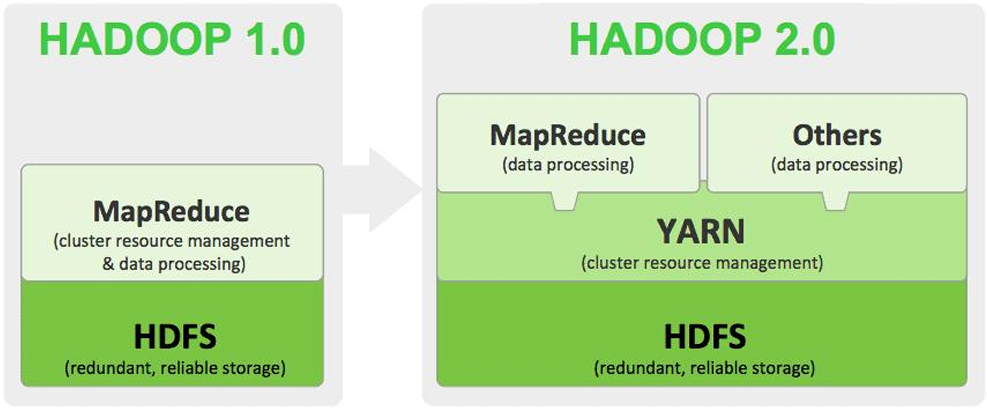
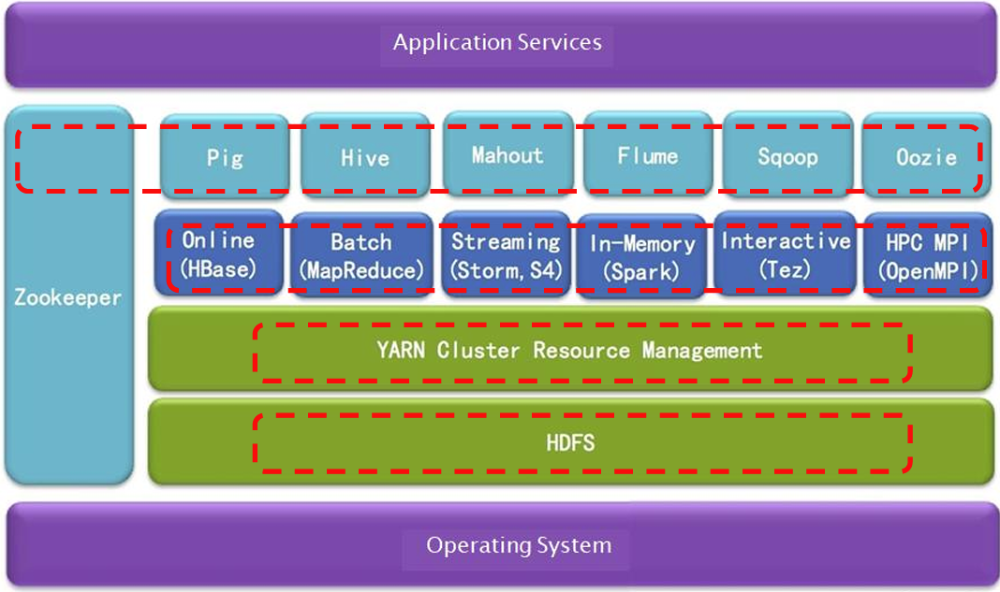
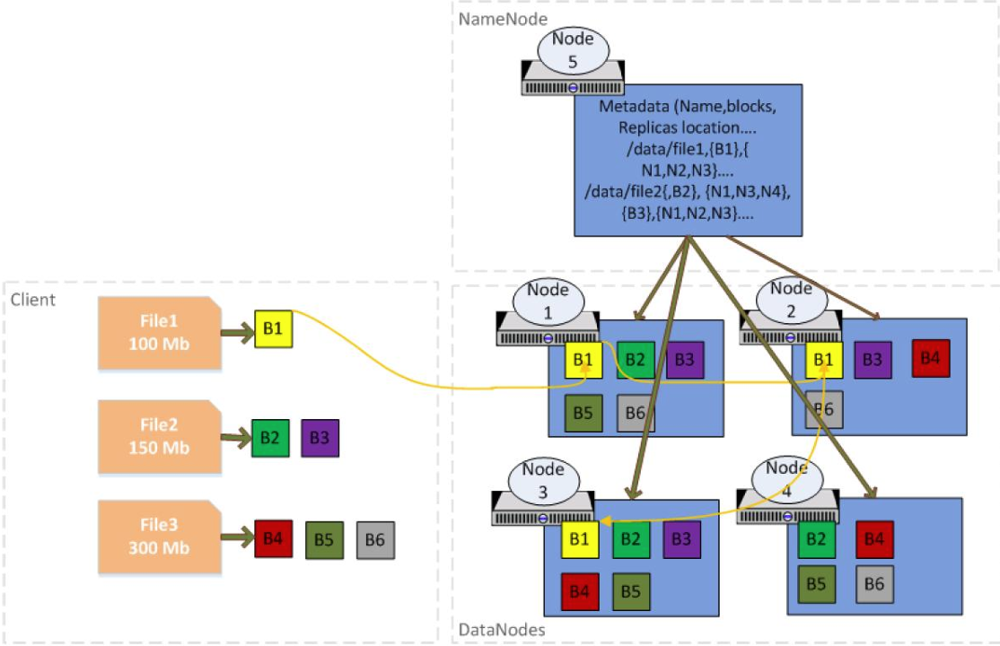

# Getting Started with Apache Hadoop

> __Hadoop + Spark__ practice the most practical machine learning algorithms,
> __Algorithms + Software__ to create the core characteristics of competitiveness.

## Introducing Apache Hadoop

1. Hadoop is an open source software framework from the Apache Foundation
    - Enables distributed processing on large clusters with thousands of nodes and petabytes of data
    - For avoiding significant network I/O, Hadoop uses the move computation to the data approach
    - Developments only need to focus on business logic rather than doing the heavy lifting of distributing data, distributing code for parallel processing, and handling failures
2. Java-based software framework for distributed processing of data
3. The version of Apache Hadoop is divided into two generations, the first generation is called Hadoop 1.0 and the second generation is called Hadoop 2.0. The second generation, consisting of 2 versions 0.23.x and 2.x, is completely different from Hadoop 1.0, and is a new set of architecture.

### Four parts of Apache Hadoop

- Hadoop Common: provides public applications
- Hadoop Distributed File System(HDFS): used to store data
- Yet Another Resource Negotiator(YARN): used to manage the resources of the clusters
- MapReduce: provides a parallel computing framework for processing data

### Typical characteristics of Apache Hadoop

- Commodity
- Robust
- Scalable
- Simple
- Data locality

## Hadoop Distributed File System

- HDFS is a distributed filesystem that provided high scalability and reliability on large clusters of commodity hardware
- HDFS are divided into large blocks that are typically 128MB in size and distributed across the cluster
- Each block is replicated (typically 3 times) to handle hardware failures and block placement exposed by NameNode so that computation can be moved to data with MapReduce framework.

### Introducing HDFS

- HDFS uses a master/slave architecture, consisting of a NameNode and several DataNodes
- The NameNode acts as the primary server
- The DataNode is responsible for handling the read and write requests for the stored data

### Features of HDFS

Unlimited scalability

- High availability
- Data integrity
- HDFS ACLs
- HDFS rebalancing
- Caching
- APIs
- Data Encryption
- NFS access
- Write Once and Read Many

### Storage options on Hadoop

Hadoop can store all the data regradless of what format the data is stored in.

## MapReduce Parallel Computing Framework

### Introducing MapReduce

- MapReduce (MR) is a framework to write analytical applications in batch mode on terabytes or petabytes of data stored on HDFS.
- An MR job usually processes each block (excluding replicas) of input file(s) in HDFS with the mapper tasks in a parallel manner.
- The MR framework sorts and shuffles the outputs of the mappers to the reduce tasks in order to produce the output.
- The framework takes care of computing the number of tasks needed, scheduling tasks, monitoring them, and re-executing them if they fail. The developer needs to focus only on writing the business logic.
- MR distributes tasks to each node in the cluster and processes large data sets in parallel in a highly fault-tolerant manner.
- In the early MapReduce framework, it was composed of a single JobTracker process running on the master node and a TaskTracker process running on each cluster slave node.
- The master JobTracker is responsible for scheduling all the TaskTasks of the JobJob, which are distributed on different slave nodes.
- The master node monitors the execution of each Task through the heartbeat mechanism and re-executes the previously failed tasks.
